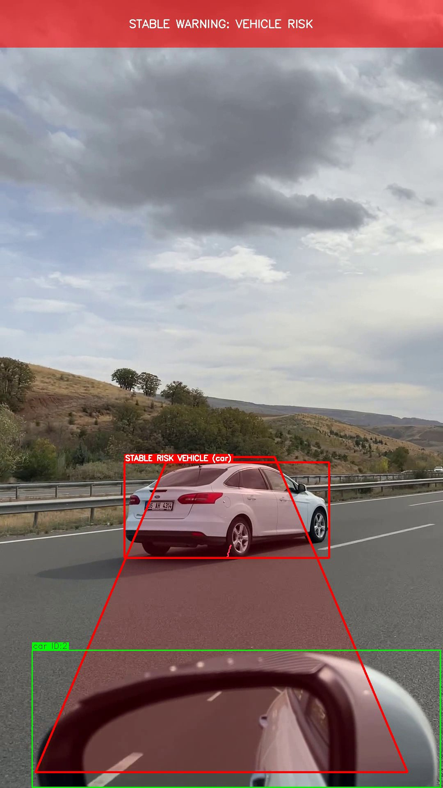
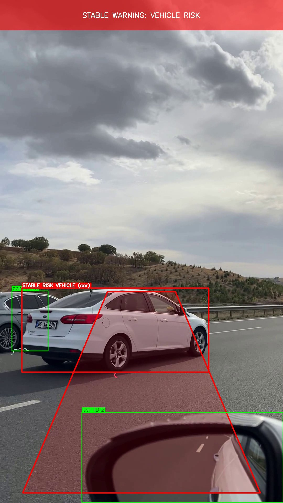
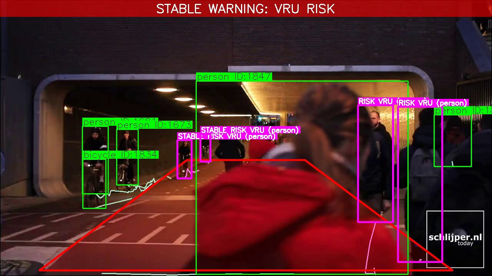
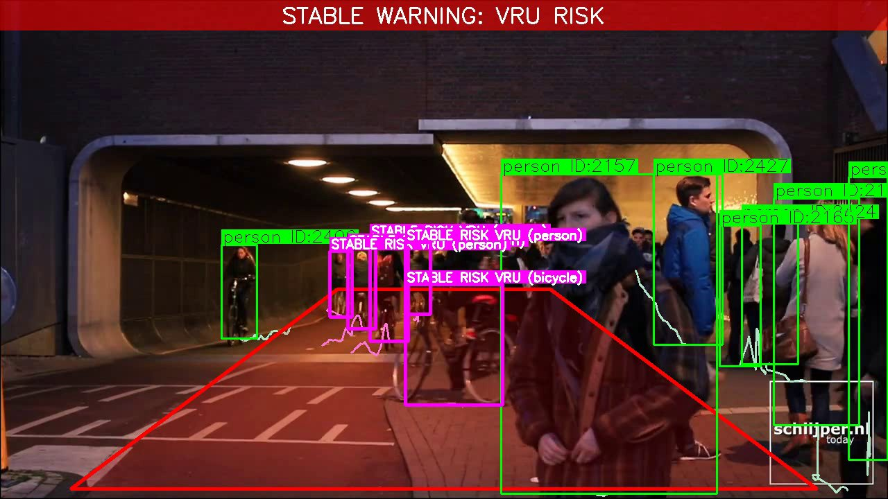
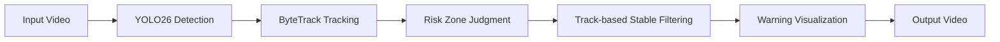

# YOLO26 智能驾驶道路参与者检测与风险预警系统

基于 **YOLO26** 与 **ByteTrack** 的智能驾驶道路目标检测与风险预警系统。支持对车载视频进行逐帧检测、车辆风险预警、弱势交通参与者（VRU）风险提示，以及基于 Track ID 的稳定风险过滤。

## 效果展示

### 车辆风险预警 + 轨迹线（快速路跟车场景）



> STABLE WARNING + 红色轨迹线 — 前方车辆落入风险梯形区域，触发稳定风险预警。轨迹线显示车辆 ID 1 的运动历史。



> 绿色 Track ID 框 + 浅青绿轨迹线 — 非风险目标以绿色标注，底部中心点轨迹清晰可见。

### VRU 风险预警 + 轨迹线（城市行人/自行车场景）



> STABLE WARNING + 品红轨迹线 — 行人/自行车被稳定追踪，风险目标显示 STABLE RISK VRU 标签和品红色轨迹。



> 多目标轨迹可视化 — 绿色框显示 Track ID，浅青绿轨迹展示行人运动路径，品红框标记风险 VRU。

---

## 技术流程



1. **YOLO26 Detection** — 逐帧检测道路参与者（车辆、行人、自行车、摩托车等）
2. **ByteTrack Tracking** — 为每个目标分配稳定 Track ID
3. **Risk Zone Judgment** — 判断目标是否落入前方风险梯形区域 + bbox 高度比约束
4. **Track-based Stable Filtering** — 同一 Track ID 累计 >= 5 帧风险帧才触发稳定预警
5. **Warning Visualization** — 叠加风险区域、RISK/STABLE 标记、预警横幅
6. **Output Video** — 输出带标注的视频与统计信息

---

## 功能特点

- **YOLO26 道路目标检测** — 基于 Ultralytics YOLO26 nano，CPU 可运行
- **车辆风险区域预警** — 前方梯形风险区域 + 近距视觉约束（bbox 高度比 >= 0.12）
- **VRU 风险提示** — 行人/自行车/摩托车独立判定，视觉区分品红色标记
- **ByteTrack 多目标跟踪** — 为每个目标分配稳定 Track ID
- **稳定风险过滤** — 基于 Track ID 累计帧数过滤单帧误检和短暂闪烁
- **轨迹线可视化** — 展示目标最近 30 帧运动轨迹，风险目标使用区分颜色
- **统计信息输出** — 总帧数、风险帧数、风险占比、各 ID 持续帧数

---

## 项目结构

```
├── assets/                         # README 展示图片（入 Git）
│   ├── vehicle_traj_risk_01.jpg
│   ├── vehicle_traj_risk_02.jpg
│   ├── vru_traj_risk_01.jpg
│   └── vru_traj_risk_02.jpg
├── data/
│   └── test_videos/                # 测试视频（不入库）
├── scripts/
│   ├── predict_video.py            # 逐帧检测 + 风险预警（主入口）
│   ├── track_video.py              # ByteTrack 跟踪 + 轨迹线 + 稳定风险过滤
│   ├── extract_frames.py           # 帧抽取工具
│   └── analyze_samples.py          # 抽样帧分析工具
├── utils/
│   ├── __init__.py
│   └── warning_utils.py            # 风险区域、双类预警判定、绘制工具
├── outputs/
│   └── videos/                     # 检测结果视频（不入库）
├── .gitignore
├── PROJECT_LOG.md                  # 项目开发记录
└── README.md
```

---

## 快速开始

```bash
# 创建虚拟环境并安装依赖
python -m venv .venv
.venv/Scripts/activate
pip install ultralytics opencv-python

# 基础风险检测（逐帧检测 + 风险预警）
python scripts/predict_video.py

# ByteTrack 跟踪 + 稳定风险过滤
python scripts/track_video.py

# 指定城市 VRU 视频
python scripts/track_video.py \
  --input data/test_videos/road_city_vru_01.mp4 \
  --output outputs/videos/road_city_vru_01_tracked_stable_warning.mp4
```

输出视频保存在 `outputs/videos/` 目录下。

---

## 风险预警规则

### 两类风险目标

| 类别 | 关注目标 | bbox 高度比阈值 |
|------|----------|----------------|
| 车辆 (Vehicle) | car, bus, truck | >= 0.12 |
| 弱势交通参与者 (VRU) | person, bicycle, motorcycle | >= 0.10 |

> VRU 阈值 0.10 经实景城市行人/自行车视频校准，可过滤极远小目标，近处行人/骑行者仍正常触发。

### 判定规则（两层）

1. 检测框底边中心点落入前方风险梯形区域（射线法）
2. 检测框高度 / 画面高度 >= 对应阈值

### 稳定风险过滤

同一 Track ID 在风险区累计帧数 >= **5** 帧时，触发稳定风险预警（`STABLE RISK VEHICLE` / `STABLE RISK VRU`），减少单帧误检和短暂闪烁。

### 视觉区分

| 风险级别 | 框颜色 | 标签 |
|----------|--------|------|
| 普通目标 | 绿色 | `class_name ID:#` |
| 车辆风险（未稳定） | 红色粗框 | `RISK VEHICLE` |
| VRU 风险（未稳定） | 品红粗框 | `RISK VRU` |
| 稳定车辆风险 | 红色粗框 | `STABLE RISK VEHICLE` |
| 稳定 VRU 风险 | 品红粗框 | `STABLE RISK VRU` |

### 预警横幅优先级

| 条件 | 横幅文案 |
|------|----------|
| 稳定车辆 + 稳定 VRU | STABLE WARNING: VEHICLE AND VRU RISK |
| 仅稳定车辆 | STABLE WARNING: VEHICLE RISK |
| 仅稳定 VRU | STABLE WARNING: VRU RISK |
| 车辆 + VRU（未稳定） | WARNING: VEHICLE AND VRU IN RISK ZONE |
| 仅车辆（未稳定） | WARNING: VEHICLE IN RISK ZONE |
| 仅 VRU（未稳定） | WARNING: VRU IN RISK ZONE |
| 无风险 | 不显示 |

---

## 测试视频

项目使用两个代表性测试视频，覆盖车辆风险与 VRU 风险两个维度。测试视频和输出视频因体积较大，已通过 `.gitignore` 排除。

| 视频 | 场景 | 验证目标 | 帧数 | 稳定风险占比 |
|------|------|----------|------|-------------|
| `road_drive_01.mp4` | 快速路 / 跟车 | 车辆风险预警 | 722 | 69.0% |
| `road_city_vru_01.mp4` | 城市道路 / 行人自行车 | VRU 风险提示 | 1800 | 93.7% |

---

## 项目局限

- **未使用真实距离估计** — 风险判定基于图像空间（bbox 高度比 + 梯形区域），非物理距离
- **风险区域依赖摄像头视角** — 切换摄像头或安装位置需重新标定梯形坐标和阈值
- **Track ID 碎片化** — 行人密集场景下 ByteTrack 可能产生短命 ID，需累计帧数过滤
- **未做车道线/可行驶区域分割** — 无法区分本车道与相邻车道
- **暂未做 GUI** — 当前为命令行脚本，无图形交互界面

---

## 后续计划

- [x] 轨迹线绘制（基于 Track ID 历史位置）
- [ ] 预警迟滞 / 滑动窗口平滑（减少临界帧闪烁）
- [ ] 风险梯形区域自适应标定
- [ ] 更多道路场景测试视频
- [ ] GUI 可视化（可选）
- [ ] 接入车道线检测（可选）

---

## 当前进度

- [x] YOLO26 基础图片推理验证
- [x] 道路视频逐帧推理工程脚本
- [x] 前方车辆风险区域绘制与预警
- [x] 风险预警逻辑校准（bbox 高度比阈值）
- [x] 弱势交通参与者（VRU）风险提示
- [x] VRU 风险阈值校准（0.06 → 0.10）
- [x] ByteTrack 多目标跟踪与 Track ID 标注
- [x] 基于 Track ID 的稳定风险过滤（>= 5 帧）
- [x] 项目展示与 README 强化
- [x] 轨迹线绘制与运动轨迹可视化
